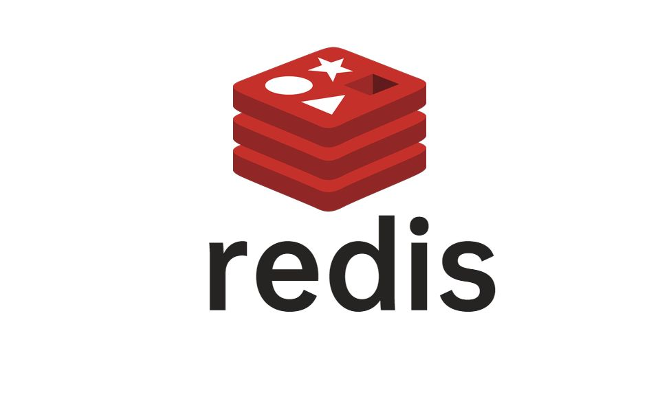

# Redis SOURCE CODE ANALYSIS

The open source, in-memory data store used by millions of developers as a database, cache, streaming engine, and message broker.

* KEY-VALUE

* In memory

## DESCRIPTION

This repository contains an analysis of Redis source code and a 
summary of the textbook "Redis Core Principles and Practices".

This article is based on the Redis 7.0.10 source code.

## DIRECTORY STRUCTURE

* src Redis source code fragment

* notes Reading notes.

* CONTENTS

  *  PART 1 DATA STRUCTURE & ENCODING
  
     *   CHAPTER 1 STRING
  
     *   CHAPTER 2 LIST
 
     *   CHAPTER 3 HASH
  
     *   CHAPTER 4 SET

  * PARR 2 EVENT & COMMAND

    * CHAPTER 5 REDIS SERVER STARTUP PROCESS

    * CHAPTER 6 EVENT MECHANISM

    * CHAPTER 7 epoll & NETWORK COMMUNICATIONS

    * CHAPTER 8 CLIENT

    * CHAPTER 9 COMMAND PROCESS

    * CHAPTER 10 NETWORK & I/O

  * PART 3 PERSISTENCE & COPY

  * PART 4 DISTRIBUTED FRAMEWORK

  * PART 5 ADVANCED FEATURES